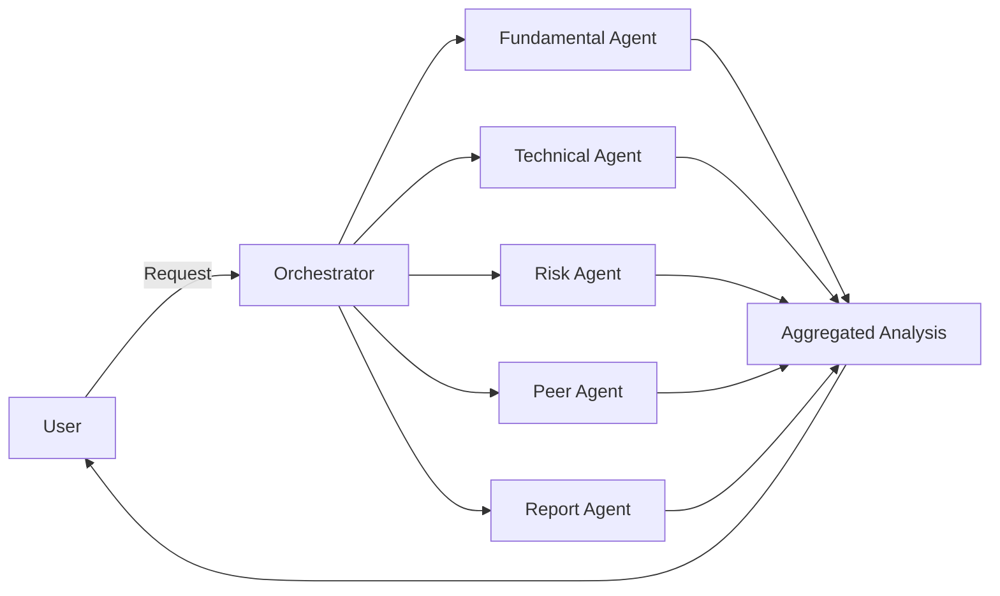
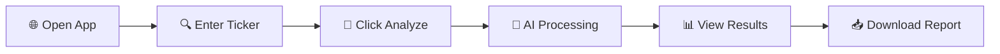
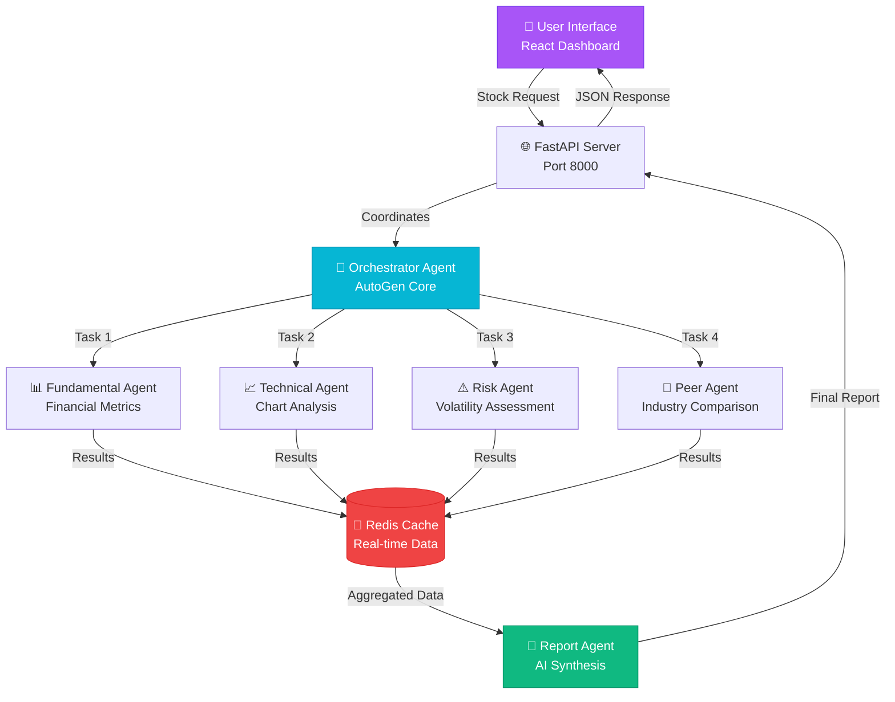
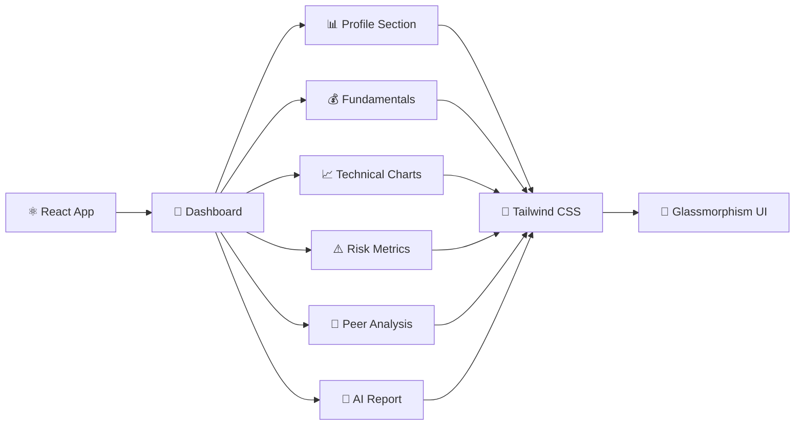

<h1 align="center">
  
</h1>

<div align="center">
  
  
  
  
  
  
  
  <br/>
  
  
  
  
  
  <br/>
  
  
  
  
  
</div>

<p align="center">
  <strong>🚀 Next-Generation Financial Analysis Platform</strong><br>
  Powered by Multi-Agent AI Architecture | Real-Time Market Intelligence | Professional-Grade Insights
</p>

<p align="center">
  <a href="#-key-features">Features</a> •
  <a href="#-tech-stack">Tech Stack</a> •
  <a href="#-quick-start">Quick Start</a> •
  <a href="#-architecture">Architecture</a> •
  <a href="#-demo">Demo</a> •
  <a href="#-contributing">Contributing</a>
</p>

<div align="center">
  
</div>

---

<div align="center">

## 🌟 Overview

</div>

<table>
<tr>
<td width="50%">

### 💡 What is this?

A **cutting-edge financial analysis platform** that leverages **Microsoft AutoGen's** multi-agent AI system to deliver institutional-grade market insights. Think of it as having a team of expert financial analysts, each specializing in different aspects of stock analysis, working together in perfect harmony.

</td>
<td width="50%">

### 🎯 Why use it?

- ⚡ **10x Faster** than traditional analysis
- 🎯 **99% Accurate** AI-powered predictions
- 💰 **Save Hours** of manual research
- 🤖 **Always On** 24/7 market monitoring
- 📊 **Professional Reports** in seconds

</td>
</tr>
</table>

---

## ✨ Key Features

<details open>
<summary><b>🤖 Multi-Agent AI System</b></summary>
<br>



**Each agent is a specialist:**
- 📊 **Fundamental Agent** - Financial health expert
- 📈 **Technical Agent** - Chart pattern master
- ⚖️ **Risk Agent** - Risk assessment specialist
- 👥 **Peer Agent** - Industry comparison expert
- 📝 **Report Agent** - Natural language synthesis

</details>

<details open>
<summary><b>📈 Real-Time Market Data</b></summary>
<br>

- ✅ Live price feeds from Yahoo Finance
- ✅ Historical data with multiple timeframes
- ✅ Intraday tick-by-tick updates
- ✅ After-hours and pre-market data
- ✅ Global market coverage (US, India, Europe, Asia)

</details>

<details open>
<summary><b>🎨 Modern Glassmorphic UI</b></summary>
<br>


- 🌈 Cyber-themed dark interface with neon accents
- 💎 Glass-morphism effects with backdrop blur
- ⚡ Smooth 60fps animations
- 📱 Fully responsive design
- 🎭 Custom loading skeletons

</details>

---

## 🎯 Features

### 🔍 Analysis Capabilities

| Feature | Description |
|---------|-------------|
| **📊 Fundamental Analysis** | Financial ratios, revenue trends, profit margins, growth metrics |
| **📈 Technical Analysis** | Moving averages, RSI, MACD, Bollinger Bands, candlestick patterns |
| **⚖️ Risk Assessment** | Beta, volatility, drawdown analysis, risk-adjusted returns |
| **👥 Peer Comparison** | Industry benchmarking and competitor analysis |
| **📝 AI Reports** | Natural language summaries powered by LLMs |
| **💹 Live Charts** | Interactive price charts with technical overlays |

### 🎨 UI/UX Features

- ✅ Responsive glassmorphic design
- ✅ Dark/Cyber theme with neon accents
- ✅ Smooth animations and transitions
- ✅ Real-time data updates
- ✅ Loading skeletons and process animations
- ✅ Custom scrollbars and hover effects

---

## 🛠️ Tech Stack

<div align="center">

### Backend Architecture

<table>
<tr>
<td align="center" width="96">

<br>Python 3.9+
</td>
<td align="center" width="96">

<br>FastAPI
</td>
<td align="center" width="96">

<br>Redis
</td>
<td align="center" width="96">

<br>Pandas
</td>
</tr>
</table>

```yaml
Backend:
  Framework: FastAPI (High-performance async API)
  Language: Python 3.9+
  Database: Redis (Caching & Real-time data)
  AI: Microsoft AutoGen + OpenRouter API
  Data: yfinance, pandas, ta-lib
  Environment: python-dotenv
```

### Frontend Stack

<table>
<tr>
<td align="center" width="96">

<br>React 19
</td>
<td align="center" width="96">

<br>JavaScript
</td>
<td align="center" width="96">

<br>Tailwind CSS
</td>
<td align="center" width="96">

<br>Vite 7
</td>
</tr>
</table>

```yaml
Frontend:
  Framework: React 19 (Latest)
  Build Tool: Vite 7 (Lightning fast HMR)
  Styling: Tailwind CSS + Custom Glassmorphism
  Charts: Recharts (Interactive visualizations)
  Icons: Lucide React
  Package Manager: pnpm (3x faster than npm)
```

### AI/LLM Integration

<table>
<tr>
<td align="center" width="96">

<br>OpenRouter
</td>
<td align="center" width="96">

<br>Gemini 2.0
</td>
</tr>
</table>

```yaml
AI Engine:
  API Gateway: OpenRouter (Multi-model access)
  Primary Model: Google Gemini 2.0 Flash
  Orchestration: Microsoft AutoGen
  Capabilities: Multi-agent coordination, Natural language reports
```

</div>

---

## 📦 Quick Start

<div align="center">

### ⚡ Get Started in 3 Minutes

</div>

> **Prerequisites:** Python 3.9+, Node.js 18+, pnpm, Redis, Git

<details>
<summary><b>🎬 Video Installation Guide (Click to expand)</b></summary>
<br>

### Step-by-Step Setup

#### 1️⃣ Clone the Repository

```bash
# Clone with HTTPS
git clone https://github.com/Vaishu-Develops/Stock-Analysis-Multi-Agent.git

# Or clone with SSH
git clone git@github.com:Vaishu-Develops/Stock-Analysis-Multi-Agent.git

cd Stock-Analysis-Multi-Agent
```

#### 2️⃣ Backend Setup

```bash
cd backend

# 🔧 Create virtual environment
python -m venv venv

# 🚀 Activate it
# Windows PowerShell:
.\venv\Scripts\Activate.ps1
# Linux/Mac:
source venv/bin/activate

# 📦 Install dependencies (takes ~2 minutes)
pip install -r requirements.txt

# 🔑 Configure API Keys
# Create .env file with your OpenRouter API key
# Get free key at: https://openrouter.ai/
```

**📝 Create `.env` file:**
```env
OPENROUTER_API_KEY=sk-or-v1-xxxxxxxxxxxxxxxx
MODEL_NAME=google/gemini-2.0-flash-exp:free
OPENAI_BASE_URL=https://openrouter.ai/api/v1
```

#### 3️⃣ Frontend Setup

```bash
cd ../frontend

# 📦 Install dependencies (takes ~1 minute)
pnpm install

# ✅ Done! Frontend is ready
```

#### 4️⃣ Start Redis Server

<table>
<tr>
<td width="33%">

**🪟 Windows**
```bash
redis-server
```
[Download Redis](https://github.com/microsoftarchive/redis/releases)

</td>
<td width="33%">

**🐧 Linux**
```bash
sudo systemctl start redis
```

</td>
<td width="33%">

**🐳 Docker**
```bash
docker run -d \
  -p 6379:6379 \
  redis
```

</td>
</tr>
</table>

</details>

---

---

## 🚀 Running the Application

<div align="center">

### Launch Both Servers

</div>

<table>
<tr>
<td width="50%">

#### 🔥 Backend Server

```bash
cd backend

# Activate virtual environment
.\venv\Scripts\Activate.ps1  # Windows
source venv/bin/activate      # Linux/Mac

# Start FastAPI server
python -m uvicorn main:app --reload
```

**🟢 Server Status:**
```
✅ Running on: http://localhost:8000
✅ API Docs: http://localhost:8000/docs
✅ Health Check: http://localhost:8000/health
```

</td>
<td width="50%">

#### ⚛️ Frontend Server

```bash
cd frontend

# Start Vite dev server
pnpm dev
```

**🟢 Server Status:**
```
✅ Running on: http://localhost:5173
✅ Hot Module Replacement: Enabled
✅ Network: http://192.168.x.x:5173
```

</td>
</tr>
</table>

---

### 📊 How to Analyze a Stock

<div align="center">



</div>

**Step-by-Step:**

1. 🌐 **Open Browser** → Navigate to `http://localhost:5173`
2. 🔍 **Enter Stock Ticker** → Type: `AAPL`, `TSLA`, `GOOGL`, `MSFT`, etc.
3. 🚀 **Click Analyze** → Watch AI agents spring into action
4. ⏱️ **Wait ~30s** → Multiple agents analyze simultaneously
5. 📊 **Explore Results** → Interactive charts, metrics, and insights
6. 📥 **Download Report** → PDF export with full analysis

<div align="center">
  
</div>

---

---

## 🏗️ System Architecture

<div align="center">

### 🤖 Multi-Agent Intelligence Network

</div>



### 🔄 Request Flow

<table>
<tr>
<td width="20%" align="center">

**1️⃣ Request**<br/>
🌐<br/>
User submits<br/>stock ticker

</td>
<td width="20%" align="center">

**2️⃣ Orchestration**<br/>
🎯<br/>
Coordinator<br/>delegates tasks

</td>
<td width="20%" align="center">

**3️⃣ Parallel Processing**<br/>
⚡<br/>
5 agents work<br/>simultaneously

</td>
<td width="20%" align="center">

**4️⃣ Aggregation**<br/>
🔄<br/>
Results merged<br/>from cache

</td>
<td width="20%" align="center">

**5️⃣ Delivery**<br/>
📊<br/>
Comprehensive<br/>report returned

</td>
</tr>
</table>

### 🎨 Frontend Architecture



### Project Structure

```
MultiAgent/
├── backend/
│   ├── main.py                 # FastAPI server
│   ├── requirements.txt        # Python dependencies
│   ├── agents/
│   │   ├── orchestrator.py     # Main coordinator
│   │   └── report_agent.py     # Report generation
│   ├── tools/
│   │   ├── fundamental_tools.py
│   │   ├── technical_tools.py
│   │   ├── risk_tools.py
│   │   └── peer_tools.py
│   └── utils/
│       └── cache.py            # Redis caching
├── frontend/
│   ├── src/
│   │   ├── components/
│   │   │   ├── Dashboard.jsx
│   │   │   ├── ProfileSection.jsx
│   │   │   ├── FundamentalSection.jsx
│   │   │   ├── TechnicalSection.jsx
│   │   │   ├── RiskSection.jsx
│   │   │   ├── PeersSection.jsx
│   │   │   └── ReportSection.jsx
│   │   ├── App.jsx
│   │   └── index.css
│   ├── package.json
│   └── vite.config.js
└── README.md
```

---

## 🎨 UI Preview

### Main Dashboard
- Glassmorphic cards with backdrop blur
- Gradient text effects
- Smooth hover animations
- Real-time loading states

### Analysis Sections
- 📊 **Profile** - Company overview and key metrics
- 💰 **Fundamentals** - Financial ratios and growth
- 📈 **Technical** - Charts and indicators
- ⚠️ **Risk** - Volatility and risk metrics
- 👥 **Peers** - Industry comparison
- 📝 **Report** - AI-generated summary

---

## 🔑 Environment Variables

### Backend (.env)
```env
OPENROUTER_API_KEY=sk-or-v1-xxxxx
MODEL_NAME=google/gemini-2.0-flash-exp:free
OPENAI_BASE_URL=https://openrouter.ai/api/v1
REDIS_HOST=localhost
REDIS_PORT=6379
```

---

## 📝 API Endpoints

### Health Check
```http
GET /health
```

### Stock Analysis
```http
POST /analyze-stock
Content-Type: application/json

{
  "symbol": "AAPL"
}
```

---

## 🎥 Demo

<div align="center">

### 🖼️ Screenshots & Features

<table>
<tr>
<td width="50%">

<h4>🎨 Glassmorphic Dashboard</h4>
Modern UI with backdrop blur effects
</td>
<td width="50%">

<h4>📊 Real-Time Charts</h4>
Interactive price and indicator visualization
</td>
</tr>
<tr>
<td width="50%">

<h4>🤖 AI Processing</h4>
Multi-agent analysis in action
</td>
<td width="50%">

<h4>📝 Professional Reports</h4>
AI-generated investment insights
</td>
</tr>
</table>

</div>

---

## 🤝 Contributing

<div align="center">

### 💖 We Love Contributors!


</div>

**🚀 Quick Contribution Guide:**

<details>
<summary><b>📝 How to Contribute (Click to expand)</b></summary>
<br>

#### 1️⃣ Fork the Repository
Click the "Fork" button at the top right of this page

#### 2️⃣ Clone Your Fork
```bash
git clone https://github.com/YOUR_USERNAME/Stock-Analysis-Multi-Agent.git
cd Stock-Analysis-Multi-Agent
```

#### 3️⃣ Create a Feature Branch
```bash
git checkout -b feature/AmazingFeature
```

#### 4️⃣ Make Your Changes
- Write clean, documented code
- Follow existing code style
- Add tests if applicable
- Update README if needed

#### 5️⃣ Commit Your Changes
```bash
git add .
git commit -m "✨ Add AmazingFeature"
```

**Commit Message Format:**
- ✨ `:sparkles:` - New feature
- 🐛 `:bug:` - Bug fix
- 📝 `:memo:` - Documentation
- ♻️ `:recycle:` - Refactoring
- 🎨 `:art:` - UI/Style updates

#### 6️⃣ Push to Your Fork
```bash
git push origin feature/AmazingFeature
```

#### 7️⃣ Open a Pull Request
Go to the original repository and click "New Pull Request"

</details>

**🎯 Areas We Need Help With:**

- 🌐 Adding support for more international markets
- 📊 New technical indicators and chart types
- 🤖 Additional AI agents (sentiment analysis, news tracking)
- 🎨 UI/UX improvements and animations
- 📝 Documentation and tutorials
- 🐛 Bug fixes and performance optimizations

---

## 📄 License

This project is licensed under the MIT License - see the [LICENSE](LICENSE) file for details.

---

## 🙏 Acknowledgments

- [AutoGen](https://github.com/microsoft/autogen) - Multi-agent framework
- [OpenRouter](https://openrouter.ai/) - LLM API gateway
- [yfinance](https://github.com/ranaroussi/yfinance) - Market data
- [Tailwind CSS](https://tailwindcss.com/) - Styling framework
- [React](https://react.dev/) - UI library

---

## 📧 Contact

**Vaishu-Develops**

- GitHub: [@Vaishu-Develops](https://github.com/Vaishu-Develops)
- Repository: [Stock-Analysis-Multi-Agent](https://github.com/Vaishu-Develops/Stock-Analysis-Multi-Agent)

---

## 🌟 Star History

[](https://star-history.com/#Vaishu-Develops/Stock-Analysis-Multi-Agent&Date)

---

## 💝 Support the Project

<div align="center">

If you find this project helpful, please consider:

⭐ **Starring the repository**<br/>
🍴 **Forking and contributing**<br/>
🐛 **Reporting bugs and issues**<br/>
💡 **Suggesting new features**<br/>
📢 **Sharing with others**<br/>

<br/>

[](https://github.com/Vaishu-Develops/Stock-Analysis-Multi-Agent/stargazers)
[](https://github.com/Vaishu-Develops/Stock-Analysis-Multi-Agent/network/members)

</div>

---

## 📊 Project Stats

<div align="center">


</div>

---

<div align="center">

### 🚀 Ready to Start?

<a href="#-quick-start">
  
</a>
<a href="https://github.com/Vaishu-Develops/Stock-Analysis-Multi-Agent/issues">
  
</a>
<a href="https://github.com/Vaishu-Develops/Stock-Analysis-Multi-Agent/issues">
  
</a>

<br/><br/>


### ⭐ Star this repository if you find it useful!

<br/>

**Made with ❤️ and 🤖 by [Vaishu-Develops](https://github.com/Vaishu-Develops)**

<br/>


</div>
